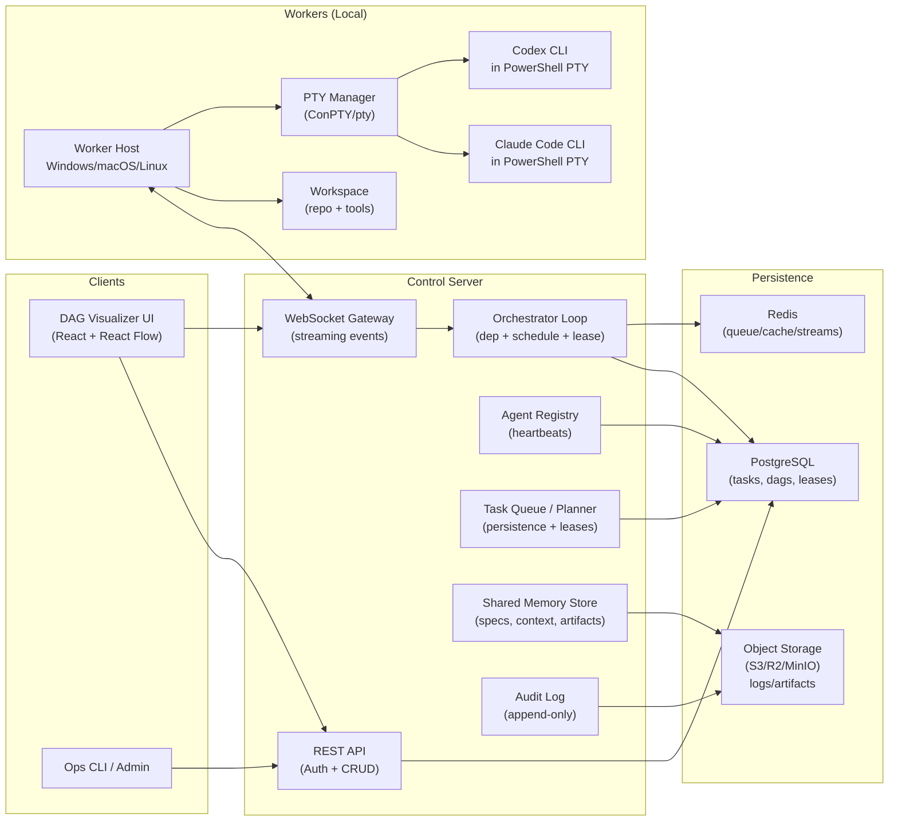
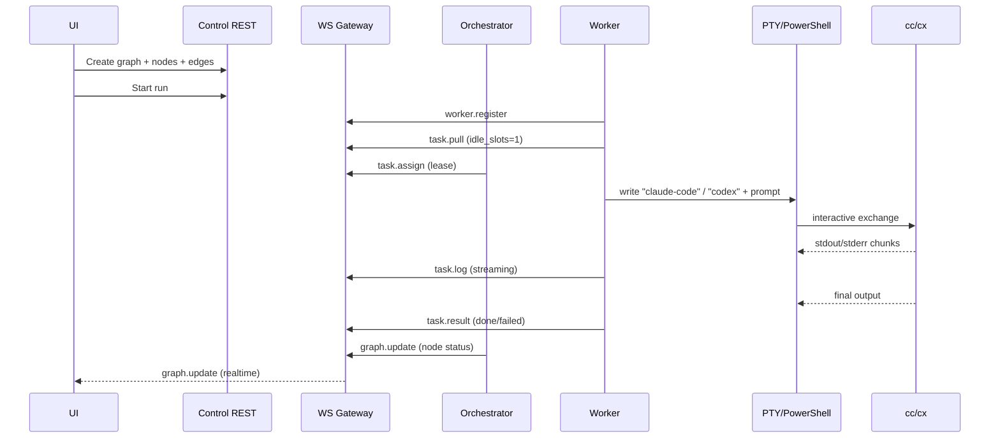

# 生产级 Agent Orchestrator 与 DAG 可视化系统 PRD

## 执行摘要

本 PRD 定义一个生产可用的 **Agent Orchestrator + DAG Visualizer** 系统：通过统一的控制平面（Control Server）把本地运行的 **Claude Code（cc）** 与 **Codex CLI（cx）** 以 **Worker** 方式接入，并用 **任务 DAG** 表达依赖关系与执行编排，支持“人工可视化编排”和“AI 生成计划即任务（plans-as-tasks）”，采用 **Worker pull 模型**（Worker 主动领取任务）在多台开发机/构建机上水平扩展。系统重点在“可控、审计、节流、可恢复”，而非“无限自动化”。  

技术关键点：  
- CLI 代理往往需要终端 TTY 才能稳定交互，生产实现应优先使用 **PTY（Windows 上基于 ConPTY）** 而非简单 spawn 管道；`node-pty` 明确依赖 Windows 10 1809+ 的 ConPTY 能力。citeturn0search4turn0search9  
- Windows ConPTY 模型要求宿主在创建子进程前先创建 pseudoconsole 与通信通道，暗示“attach 既有 PowerShell 窗口/会话”并不顺畅，工程上建议“Worker 自己 spawn + 管理会话生命周期”。citeturn0search5  
- 合规风险主要来自订阅账号共享、非人类自动化访问与规避限流：Anthropic 消费者条款明确禁止共享账号凭证，并禁止（除 API Key/明确许可外）通过自动化/非人类方式访问服务。citeturn4view0 OpenAI 亦明确声明账号仅供创建者本人使用。citeturn1search6  
- 因此系统必须内建：**人类在环审批、并发上限、输入节流、会话 TTL、审计日志、任务权限边界**。citeturn4view0turn2search2turn8search3  

本报告给出：目标与人群、核心用例、架构与协议、调度与可靠性策略、安全/合规加固、可观测性与测试策略、MVP 路线图（含工期估算与成功标准）、以及 JSON Schema 与消息样例。

## 系统目标与范围

### 产品目标

1) **统一编排**：用 DAG 表达任务依赖，在一个系统中统一管理 cc/cx Worker 的执行与状态。  
2) **可视化与可解释**：前端提供 DAG 可视化与编辑（节点、边、状态、日志、输入输出），“看得见为什么跑、跑到哪”。  
3) **计划即任务**：允许某个“Plan 任务”由 Agent 生成结构化计划（TaskGraph），通过校验后写入图并驱动后续执行。  
4) **可控的本地执行**：Worker 在本地目录中运行 cc/cx；Control Server 只做调度与审计，不直接执行任意 shell（除非明确授权/沙箱）。Codex CLI 与 Claude Code 都被定位为可在本地读写并运行代码的 coding agent，因此必须把 Worker 视为“本地高权限执行器”。citeturn1search0turn1search4  
5) **生产级硬化**：支持限流、重试、超时、幂等、恢复、持久化、审计、可观测与 HA 演进。

### 非目标

- **不做“接管既有 PowerShell 窗口”** 作为主路径：Windows ConPTY 的宿主模型更适合由 Worker 创建并持有 PTY；attach 既有 session 复杂且不可移植。citeturn0search5turn0search9  
- **不追求全自动无人值守的高强度循环**：这会显著放大封禁/风控与安全风险（见“安全与合规”）。

### 成功指标

- DAG 任务从创建到完成：P95 端到端延迟 < 2s 的状态更新（WebSocket 推送）。  
- Worker 稳定性：24 小时运行无 PTY 卡死（或卡死可自动重启恢复），任务丢失率≈0。  
- 调度正确性：依赖满足才执行；循环依赖 100% 检出；失败/重试/超时状态一致可追溯。  
- 审计覆盖：每次任务分配、输入、输出、人工批准、关键动作都有结构化日志与关联 ID（trace/task/agent）。  
- 合规姿态：默认启用节流、并发上限、人类在环策略与会话 TTL；明确禁止账号共享与规避限流（配置层硬约束+告警）。citeturn4view0turn1search6turn2search2  

## 用户画像与关键用例

### 用户画像

**个人开发者**  
- 需求：在本机把“实现/测试/改错/Review”拆成并行但可控的图；快速回滚与复盘。

**小团队 Tech Lead**  
- 需求：把任务拆解（Plan）标准化；多人机器跑 Worker；统一审计和进度看板；避免账号共享风险。

**自动化构建/测试维护者**  
- 需求：在 CI 类环境跑 Worker（受限权限）执行单元测试/静态检查；失败自动重试并给出可解释日志。

### 关键用例

**人工 DAG 编排**  
- 用户在前端拖拽新节点、连接依赖边、设置任务类型与输入，点击运行；系统按依赖推进、实时展示状态。

**AI 生成 plans-as-tasks**  
- 用户创建一个 Plan 节点（类型=plan），输入目标与约束；将该节点分配给特定 Agent（可优先用“规划能力强”的配置）。Agent 输出结构化 PlanOutput（tasks+edges）。系统校验通过后写入 DAG 并等待用户确认后执行（默认）。  

**Worker pull 模型**  
- Worker 启动后通过 WebSocket 注册能力与本地 workspace，持续向服务器请求任务；服务器只把“可执行且匹配能力”的任务分配给空闲 Worker。pull 模式天然更适合穿透 NAT/企业内网（Worker 出站连接）。类比 Kubernetes：kubelet 属于节点代理，负责向控制面注册并执行本地工作负载。citeturn6search2  

image_group{"layout":"carousel","aspect_ratio":"16:9","query":["React Flow node editor DAG workflow UI","node-based workflow editor React Flow dagre layout example"],"num_per_query":1}

## 架构设计与关键技术决策

### 架构总览



### 控制面组件

**Control Server**（单体可起步，后续拆分）  
- **REST API**：DAG/Task CRUD、用户与权限、计划写入、审批流、导出审计。  
- **WebSocket Gateway**：实时推送任务状态、日志流、Worker 心跳、图变更事件。WebSocket 标准定义了握手与帧，并支持双向通信。citeturn0search7  
- **Registry**：维护 Worker 在线状态、能力、标签、当前租约（lease）与最后心跳。  
- **Task Queue / Orchestrator**：  
  - DAG 依赖解析（仅当所有 upstream 完成才可就绪）。  
  - capability matching（任务类型/工具/OS/仓库要求）。  
  - 发放租约（避免双执行）。  
  - 失败重试与超时回收。

**持久化**  
- DAG 与 Task 必须落库与可恢复。队列/租约可用 DB 或 Redis 实现；本 PRD 推荐“PostgreSQL 为真相源（source of truth）+ Redis 加速”。  
- PostgreSQL 可通过 `SELECT ... FOR UPDATE SKIP LOCKED` 模式实现并发安全的队列提取：无法立即加锁的行会被跳过。citeturn7search0  
- Redis Streams 支持 consumer groups 等消费策略，适合事件流与任务分发的高吞吐场景。citeturn7search1  

### Worker 架构与 PTY 管理

#### 为什么强烈推荐 PTY 而不是简单 spawn

许多交互式 CLI 会根据是否连接 TTY 决定输出模式（进度条、颜色、交互提示、快捷键），简单用 `child_process.spawn` 的管道模式容易出现：输出碎片化、交互卡死、无法正确处理 Ctrl+C/窗口大小等。Windows 端更应使用 ConPTY。微软提供 ConPTY（Windows Pseudo Console）用于宿主应用创建伪终端，并在其中运行字符模式应用。citeturn0search9turn0search5  

`node-pty` 明确在 Windows 通过 ConPTY 支持 PTY，并要求 Windows 10 1809+；且已移除 winpty。citeturn0search4  

#### “attach 既有 PowerShell session”的可行性与结论

ConPTY 的宿主流程强调：宿主需先创建 pseudoconsole 与通信通道，再创建被托管的子进程。该模型天然偏向“hosted from birth”，而不是事后接管一个已存在的控制台进程。citeturn0search5  

**最终建议**：Worker 作为宿主，自己 spawn PowerShell PTY 并启动 cc/cx；把“连接既有窗口”作为不保证的实验功能（不纳入 MVP）。

#### Worker 责任边界

- **本地执行**：把任务输入喂给 cc/cx，并收集 stdout/stderr；必要时将日志与产物上传。  
- **沙箱与授权**：Worker 端做二次防线——对高风险动作（删库/推送/发布）要求人工批准或策略阻断。  
- **会话生命周期**：支持 session TTL（空闲 N 分钟自动重启），遇到卡死可自愈。  
- **能力上报**：OS、shell、可用工具链、repo 路径、是否允许写文件/运行测试等。

#### node-pty 示例

下面示例展示 Worker 使用 `node-pty` 在 Windows 上启动 PowerShell 并运行 CLI；Windows 端 PTY 依赖 ConPTY 与系统版本要求见 `node-pty` 说明。citeturn0search4turn0search9  

```ts
import * as pty from 'node-pty';

type PtySession = {
  id: string;
  pty: pty.IPty;
  buffer: string;
  lastOutputAt: number;
};

export function startPowershellPty(cols = 120, rows = 40): PtySession {
  const ps = pty.spawn('powershell.exe', ['-NoLogo'], {
    name: 'xterm-256color',
    cols,
    rows,
    cwd: process.cwd(),
    env: process.env as Record<string, string>,
  });

  const session: PtySession = {
    id: crypto.randomUUID(),
    pty: ps,
    buffer: '',
    lastOutputAt: Date.now(),
  };

  ps.onData((data) => {
    session.buffer += data;
    session.lastOutputAt = Date.now();
  });

  ps.onExit(() => {
    // TODO: notify control plane, mark session dead
  });

  return session;
}

// 启动 cc / cx：
// session.pty.write('claude-code\r');
// session.pty.write('codex\r');
```

### 可视化与前端技术选择

- 推荐 **React + React Flow**：React Flow 明确定位为 node-based UI 组件，支持交互式图编辑。citeturn0search2turn0search14  
- React Flow 官方示例展示了拖拽新节点（drag & drop）与外部 sidebar 的实现思路。citeturn0search6  
- 图自动布局可集成 `dagre` 或更高级的 `elkjs`；React Flow 提供 dagre 布局示例。citeturn0search10  

### 关键设计权衡表

#### PTY 与 attach 对比

| 方案 | 优点 | 缺点 | 结论 |
|---|---|---|---|
| PTY（ConPTY/pty）托管启动 | 最像真实终端；交互可靠；可控 stdin/stdout；易加审计与限流；跨平台一致 | 需要维护 PTY 生命周期；Windows 依赖 1809+；需要处理窗口大小、编码、控制序列 | **推荐默认**。Windows 上可用 ConPTY，`node-pty` 已基于该能力。citeturn0search4turn0search9 |
| attach 既有 PowerShell 窗口/进程 | 用户“无需重启已有会话”体验好（表面） | 工程复杂；可移植性差；ConPTY 模型偏向宿主先建再启进程；难保证 I/O 捕获一致性 | **不作为主路径**。优先用 Worker 自托管。citeturn0search5 |

#### spawn 管道与 PTY 对比

| 方案 | 优点 | 缺点 | 适用场景 |
|---|---|---|---|
| `spawn` + pipe | 实现简单；资源占用小 | 交互式 CLI 易行为异常（TTY 检测/控制序列）；Ctrl+C 等难处理；输出可能不完整 | 只用于非交互命令；或作为降级模式 |
| PTY | 终端语义完整；更稳的交互 | 需要处理终端控制、重连、截断、性能 | cc/cx 等交互式 agent 默认 |

#### spawn 与 attach 对比

| 维度 | spawn（创建并托管） | attach（接管既有） |
|---|---|---|
| 可控性 | 高（从启动开始就可控） | 低（历史状态不可见） |
| 可移植性 | 高（跨 OS 统一） | 低（平台差异巨大） |
| 安全审计 | 易（全链路记录） | 难（部分 I/O 不可见） |
| 推荐 | **是** | **否** |

## 调度与可靠性策略

### DAG 语义与依赖解析

DAG 的核心是“有向无环图”；在工作流系统中通常用任务节点与依赖边表达上下游关系。Apache Airflow 将 DAG 明确描述为任务集合及其依赖关系。citeturn6search3turn6search0  

系统必须实现：  
- **cycle detection**：提交/写入图时进行环检测，拒绝有环图。  
- **dependency resolution**：仅当所有依赖节点 `done`（或满足可配置的“可忽略失败”策略）时，下游节点进入 `ready`。  
- **部分重跑**：支持从某节点开始重跑时，自动回滚下游状态或生成新 run_id。

### 调度策略

建议实现“策略可插拔”，默认提供：

**FIFO**  
- 简单，适合 MVP；缺点是大任务可能阻塞小任务。

**Priority + Fairness**  
- 每个 Task 有 `priority`，并用队列权重做公平调度；适合团队环境。

**Capability Matching**  
- 根据 Worker 能力与任务需求匹配：OS（Windows/WSL/Linux）、工具链（node/python）、是否允许写文件/运行测试、repo 标签等。  
- Worker 与任务都带标签与约束表达式（例如 `requires: ["git","node>=20","windows"]`）。

**依赖优先与关键路径**  
- 对 DAG 做关键路径估计（基于历史耗时或静态权重），优先调度关键路径节点以缩短 makespan。

#### 调度算法对比表

| 算法 | 优点 | 风险/成本 | 推荐阶段 |
|---|---|---|---|
| FIFO | 实现快 | 易产生队头阻塞 | MVP |
| Priority Queue | 能保证关键任务先跑 | 需要防饥饿机制 | v1 |
| Capability Matching | 提升成功率与资源利用 | 需要维护能力模型 | v1 |
| Critical Path / HEFT 类 | 最小化总完工时间（倾向） | 估计误差、实现复杂 | v2+ |
| Work stealing | 减少热点、提升吞吐 | 需要更复杂的租约与再分配 | v2+ |

### 租约、幂等、重试与超时

**租约（lease）**  
- 分配任务时生成 `lease_id`，Worker 必须携带 lease 回报结果；Control Server 仅接受“当前 lease”的结果，避免重复提交。  
- 需要 heartbeat 续租：超时未续租则回收并重派（可能导致重复执行，因此要结合幂等）。

**幂等（idempotency）**  
- Task 输出写入应以 `(task_id, run_id)` 为幂等键；重试时产生新的 `attempt`，但写入同一 run_id 的最终状态必须可判定。  

**重试与超时**  
- 每个 Task 有 `timeout_ms`、`max_retries`、`retry_backoff`。  
- 可参考 Temporal 对“超时 + 重试策略”的组合能力：Temporal 文档强调可为工作流/活动配置超时与重试策略以提高可靠性。citeturn6search4turn6search13turn6search10  

**失败分类**  
- `FAILED_NONRETRYABLE`：语法错误、权限拒绝、schema 校验失败。  
- `FAILED_RETRYABLE`：网络错误、CLI 临时故障、超时。  
- `CANCELED`：用户取消或策略阻断。

### 持久化与队列实现选型

#### 数据库选型对比

| 选项 | 优点 | 缺点 | 适用建议 |
|---|---|---|---|
| PostgreSQL | 事务一致性强；可用 `SKIP LOCKED` 实现并发队列提取；生态成熟 | 高吞吐事件需要额外优化；要做迁移与索引设计 | **推荐作为真相源**。`SKIP LOCKED` 行为有官方定义。citeturn7search0turn7search8 |
| Redis（Streams/Lists） | 高吞吐；Streams consumer groups 适合横向扩展与 ack；可做缓存与 pubsub | 作为单一真相源需谨慎（持久化/一致性策略）；复杂查询弱 | 推荐做队列/事件层，真相源仍入库。citeturn7search1turn7search5 |
| NATS JetStream | 支持持久化与回放；可配置至少一次等语义 | 需引入新基础设施 | 高并发事件/多语言生态时考虑。citeturn7search2turn7search6 |
| Kafka | 强大的事件流平台，提供精确一次等语义保证（在特定配置下） | 运维成本高；对小团队过重 | 大规模、多系统集成再考虑。citeturn7search3 |

#### 任务队列库

若后端采用 Node.js 生态，可考虑 BullMQ（Redis-based queue）。BullMQ 官方定位为基于 Redis 的 robust queue system。citeturn5search7turn5search3  
MVP 可先用 Postgres `SKIP LOCKED` 自制队列（更少依赖），v1 再引入 BullMQ/Redis Streams 做吞吐拓展。

## 安全与合规风险评估

### 风险面概览

1) **账号共享风险**  
- Anthropic 消费者条款明确禁止共享账号登录信息/API key/凭证，并禁止让他人使用你的账号。citeturn4view0  
- OpenAI 帮助中心明确 OpenAI 账号“ meant for you—the individual who created it”。citeturn1search6  

2) **非人类自动化访问与风控触发**  
- Anthropic 条款禁止（除 API Key 或明确许可外）通过自动化或非人类方式访问服务（bot、script 等）。citeturn4view0  
- OpenAI 条款包含不得规避限流/限制或绕过保护措施等。citeturn2search2  
- 第三方报道指出 Anthropic 对“第三方 harness 造成异常流量模式”进行限制，并将其与封禁/支持困难联系起来（该点应以条款为准，报道仅说明执行背景）。citeturn2search0turn4view0  

3) **本地执行面扩大**  
Codex CLI 与 Claude Code 都被官方描述为可在本机目录中读写并运行代码的 agent；这意味着 Worker 一旦被滥用等同远程代码执行通道。citeturn1search0turn1search4  

4) **供应链与钓鱼风险**  
安全媒体报道有人用“Claude Code 下载”等关键词投放恶意广告，诱导用户下载伪装工具并粘贴恶意命令；因此安装与更新必须走官方渠道并做校验。citeturn1news38turn1search4  

### 主要检测向量与触发因素

- **高并发、多会话、无人值守循环、固定节奏输入**（行为像 bot）。  
- **“非官方客户端/脚本化调用”特征**（尤其如果试图伪装官方 harness）。  
- **异常流量模式与缺乏官方 telemetry 的行为**（报道层面提到）。citeturn2search0  

### 缓解与硬化策略

#### 人类在环与审批

- 默认策略：  
  - PlanOutput 写入 DAG 后 **必须人工确认** 才能启动执行。  
  - 对“写文件/跑命令/改依赖/推送远端”等动作按策略分级：高风险需要二次确认。  
- Claude Code 支持 hooks（包含 prompt hooks / MCP tool hooks 等），可用于在 Worker 侧拦截与校验某些工具调用与敏感操作。citeturn5search1  

#### 节流与并发限制

- **单 Worker 单任务并发**（默认 `max_concurrency=1`）。  
- 全局限流：  
  - 每 Worker 每分钟最大任务数；  
  - 每任务输入最小间隔（加入抖动 jitter）。  
- 会话 TTL：空闲自动重启；防止“长期挂起的自动化”形态。

#### 审计与可追溯

- 记录：`task_id/run_id/attempt/agent_id/workspace_hash/operator_id/approval_id`  
- 保存：请求、响应、关键状态变更、审批证据、策略命中原因。  
- 审计日志建议 append-only（对象存储或 WORM 策略）。

#### 权限与认证

- 连接控制：Worker 与 Control Server 之间建议 **mTLS 或短期令牌**。mTLS 与证书绑定令牌可显著降低凭证被盗后的重放风险（OAuth mTLS 相关规范见 RFC 8705）。citeturn8search2  
- Token：若用 JWT，可参照 RFC 7519 的声明结构与签名/加密能力。citeturn8search0  
- API 安全基线可对照 entity["organization","OWASP","api security top 10"] API Security Top 10（例如“未受限资源消耗”风险强调限流与配额的重要性）。citeturn8search3turn8search7  

#### Worker 沙箱与最小权限

- 建议 Worker 支持“受限模式”：  
  - 只允许读、禁止写；或只允许写特定子目录；  
  - 只允许运行 allowlist 工具（`npm test`、`pytest` 等）；  
  - 禁止访问生产凭证目录与 SSH key（通过 OS 权限与隔离用户实现）。  
- 对仓库目录做校验：任务声明的 `workspace_hash` 必须与本地一致，防止“把任务发到错误目录”。

### 安全检查清单

- 身份与连接  
  - [ ] Worker 与 Server 全程 TLS；生产环境启用 mTLS 或设备证书  
  - [ ] Worker 注册需要一次性 enrollment token + 设备绑定  
  - [ ] 令牌短过期 + 可吊销 + 最小权限 scope（read/write/exec）  

- 滥用与合规  
  - [ ] 默认 `max_concurrency=1`；全局与单 Worker 限流  
  - [ ] 默认启用 human-in-loop（Plan 写入、敏感任务执行）  
  - [ ] 会话 TTL + 空闲重启 + 卡死 watchdog  
  - [ ] 禁止账号共享（配置硬约束 + UI/日志警示）citeturn4view0turn1search6  

- 数据与审计  
  - [ ] 所有任务输入/输出/状态变更结构化落库与不可变审计  
  - [ ] 日志脱敏（token/密钥/PII）  
  - [ ] 关键操作双人审批（可选）  

- 供应链  
  - [ ] cc/cx 安装脚本与二进制来源校验；只用官方渠道citeturn1search4turn1news38  
  - [ ] Worker 自更新签名验证（如有）  

## 可观测性与测试保障

### 可观测性目标

- **Metrics**：任务吞吐、排队时间、执行耗时、成功率、重试率、超时率、Worker 在线数、PTY 重启次数。  
- **Logs**：结构化日志（JSON），以 task_id/agent_id/trace_id 关联。  
- **Tracing**：从 UI 操作 → API → 调度 → Worker 执行 → 结果回写的端到端 trace。  

OpenTelemetry 提供 Logs API/SDK 与信号关联思路（Resource correlation），建议作为统一遥测规范。citeturn6search23turn6search15turn6search19  

### 测试策略

**集成测试**  
- 启动真实 Worker（PTY）+ mock Control Server：验证交互、截断处理、重连、心跳、租约回收。  
- 使用录制回放（golden transcripts）：对相同输入，验证输出捕获与状态机一致（考虑模型输出非确定性，重点测协议与状态）。

**故障注入与混沌测试**  
- 网络抖动/断线：WebSocket 断开、重连、重复投递。  
- Worker 崩溃：进程被 kill、PTY 挂死、磁盘满。  
- DB/Redis 故障：主从切换、延迟升高、事务冲突。  
- 目标：无任务“幽灵运行”（无人知晓在跑）与无任务“黑洞丢失”（状态永远 pending）。

**安全测试**  
- 权限绕过：普通用户能否写入 DAG 或篡改审批。  
- 资源耗尽：大 payload、超大 DAG、请求洪泛。可参考 OWASP API “未受限资源消耗”风险类别。citeturn8search3  

## MVP 路线图与开放问题

### 推荐技术栈

**后端**  
- TypeScript + Node.js（原因：`node-pty` 成熟、WebSocket 生态完善、AJV 校验 JSON Schema）citeturn0search4  
- Web 框架：Fastify / NestJS（二选一，按团队偏好）  
- WebSocket：`ws` 或 Nest gateway（需支持 backpressure 与断线重连）

**数据库与队列**  
- PostgreSQL（真相源：DAG/Task/Lease/审批/用户/审计索引），并利用 `SKIP LOCKED` 做并发提取或做租约回收作业。citeturn7search0  
- Redis（可选）：缓存、事件流、延迟队列；若用 BullMQ，可快速获得 retry/backoff 等能力。citeturn5search7  

**Worker**  
- Node.js Worker（与 `node-pty` 一致），或 Rust/Go Worker + OS PTY（后续优化性能再做）  
- Windows 上 PTY 依赖 ConPTY；ConPTY 背景与模型见微软文档与博客。citeturn0search9turn0search5  

**前端**  
- React + React Flow（DAG 编辑/交互）citeturn0search2turn0search6turn0search10  
- 状态管理：Zustand/Redux（二选一）  
- 实时：WebSocket 订阅任务与日志流

### 数据模型与 JSON Schema

#### TaskGraph Schema

```json
{
  "$schema": "https://json-schema.org/draft/2020-12/schema",
  "$id": "https://example.com/schemas/task-graph.json",
  "title": "TaskGraph",
  "type": "object",
  "required": ["graph_id", "run_id", "nodes", "edges", "created_at"],
  "properties": {
    "graph_id": { "type": "string", "minLength": 1 },
    "run_id": { "type": "string", "minLength": 1 },
    "created_at": { "type": "string", "format": "date-time" },
    "nodes": {
      "type": "array",
      "minItems": 1,
      "items": { "$ref": "#/$defs/taskNode" }
    },
    "edges": {
      "type": "array",
      "items": { "$ref": "#/$defs/edge" }
    },
    "metadata": {
      "type": "object",
      "additionalProperties": true
    }
  },
  "$defs": {
    "taskNode": {
      "type": "object",
      "required": ["id", "title", "type", "status", "dependencies", "attempt", "created_at"],
      "properties": {
        "id": { "type": "string", "minLength": 1 },
        "title": { "type": "string", "minLength": 1, "maxLength": 200 },
        "type": { "enum": ["plan", "code", "review", "test", "lint", "docs", "custom"] },
        "status": { "enum": ["pending", "ready", "leased", "running", "done", "failed", "canceled"] },
        "priority": { "type": "integer", "minimum": 0, "maximum": 1000, "default": 100 },
        "dependencies": {
          "type": "array",
          "items": { "type": "string" },
          "uniqueItems": true
        },
        "assigned_agent_id": { "type": ["string", "null"] },
        "required_capabilities": {
          "type": "array",
          "items": { "type": "string" },
          "default": []
        },
        "input": { "type": "string", "default": "" },
        "output_ref": { "type": ["string", "null"] },
        "timeout_ms": { "type": "integer", "minimum": 1000, "default": 900000 },
        "max_retries": { "type": "integer", "minimum": 0, "maximum": 20, "default": 2 },
        "attempt": { "type": "integer", "minimum": 0 },
        "lease": {
          "type": ["object", "null"],
          "required": ["lease_id", "expires_at"],
          "properties": {
            "lease_id": { "type": "string" },
            "expires_at": { "type": "string", "format": "date-time" }
          },
          "additionalProperties": false
        },
        "created_at": { "type": "string", "format": "date-time" },
        "updated_at": { "type": "string", "format": "date-time" }
      },
      "additionalProperties": false
    },
    "edge": {
      "type": "object",
      "required": ["from", "to"],
      "properties": {
        "from": { "type": "string" },
        "to": { "type": "string" }
      },
      "additionalProperties": false
    }
  }
}
```

#### PlanOutput Schema

```json
{
  "$schema": "https://json-schema.org/draft/2020-12/schema",
  "$id": "https://example.com/schemas/plan-output.json",
  "title": "PlanOutput",
  "type": "object",
  "required": ["tasks", "edges", "assumptions", "risks"],
  "properties": {
    "tasks": {
      "type": "array",
      "minItems": 1,
      "items": {
        "type": "object",
        "required": ["id", "title", "type", "input"],
        "properties": {
          "id": { "type": "string", "minLength": 1 },
          "title": { "type": "string", "minLength": 1 },
          "type": { "enum": ["code", "review", "test", "lint", "docs", "custom"] },
          "input": { "type": "string" },
          "required_capabilities": {
            "type": "array",
            "items": { "type": "string" },
            "default": []
          },
          "estimated_minutes": { "type": "integer", "minimum": 0 }
        },
        "additionalProperties": false
      }
    },
    "edges": {
      "type": "array",
      "items": {
        "type": "array",
        "prefixItems": [{ "type": "string" }, { "type": "string" }],
        "items": false,
        "minItems": 2,
        "maxItems": 2
      }
    },
    "assumptions": { "type": "array", "items": { "type": "string" } },
    "risks": { "type": "array", "items": { "type": "string" } }
  },
  "additionalProperties": false
}
```

### 协议与 API

#### WebSocket 消息规范

WebSocket 协议定义了握手与消息帧，适合实时状态与日志流。citeturn0search7  

建议所有消息封装为：

```json
{
  "type": "string",
  "request_id": "uuid",
  "ts": "2026-03-19T12:34:56.000Z",
  "payload": {}
}
```

**Worker 注册**

```json
{
  "type": "worker.register",
  "request_id": "b6c2...",
  "ts": "2026-03-19T12:34:56.000Z",
  "payload": {
    "worker_id": "wk-001",
    "agent_kinds": ["cc", "cx"],
    "capabilities": ["windows", "git", "node>=20", "write_fs", "run_tests"],
    "workspaces": [
      { "workspace_id": "repo-abc", "path_hash": "sha256:..." }
    ],
    "max_concurrency": 1,
    "version": "worker/0.1.0"
  }
}
```

**领取任务（pull）**

```json
{
  "type": "task.pull",
  "request_id": "0f7a...",
  "ts": "2026-03-19T12:35:00.000Z",
  "payload": {
    "worker_id": "wk-001",
    "idle_slots": 1
  }
}
```

**分配任务（server→worker）**

```json
{
  "type": "task.assign",
  "request_id": "srv-9a1e...",
  "ts": "2026-03-19T12:35:00.100Z",
  "payload": {
    "graph_id": "g-001",
    "run_id": "r-20260319-01",
    "task_id": "t-compile",
    "lease_id": "lease-123",
    "lease_expires_at": "2026-03-19T12:40:00.000Z",
    "agent_kind": "cc",
    "workspace_id": "repo-abc",
    "input": "实现 X 模块并跑 unit tests",
    "timeout_ms": 900000
  }
}
```

**任务输出与日志**

```json
{
  "type": "task.log",
  "request_id": "wk-... ",
  "ts": "2026-03-19T12:35:10.000Z",
  "payload": {
    "task_id": "t-compile",
    "lease_id": "lease-123",
    "stream": "stdout",
    "chunk": "Running tests...\n"
  }
}
```

```json
{
  "type": "task.result",
  "request_id": "wk-... ",
  "ts": "2026-03-19T12:36:20.000Z",
  "payload": {
    "task_id": "t-compile",
    "lease_id": "lease-123",
    "status": "done",
    "output_ref": "s3://artifacts/.../result.json",
    "summary": "完成实现并通过测试"
  }
}
```

#### REST 端点建议

- `POST /v1/graphs`：创建 DAG  
- `GET /v1/graphs/{graph_id}`：读取图与节点状态  
- `POST /v1/graphs/{graph_id}/nodes`：创建节点  
- `POST /v1/graphs/{graph_id}/edges`：创建依赖边  
- `POST /v1/graphs/{graph_id}/validate`：校验（cycle、schema、权限）  
- `POST /v1/runs`：创建一次运行（run_id）  
- `POST /v1/tasks/{task_id}/approve`：审批  
- `POST /v1/tasks/{task_id}/cancel`：取消  
- `GET /v1/audit`：审计查询（按 run/agent/user）  

### Orchestrator Loop 流程图

```mermaid
flowchart TD
  A[Tick] --> B[Load runnable graphs/runs]
  B --> C[Compute READY tasks\n(dep satisfied, not leased)]
  C --> D[Cycle check on new/updated graphs]
  D --> E[Pick scheduling policy\nFIFO/Priority/Capabilities]
  E --> F[Match idle workers]
  F --> G[Issue leases\npersist lease_id + expires_at]
  G --> H[Dispatch task.assign via WS]
  H --> I[Monitor heartbeats + task logs]
  I --> J{Lease expired?}
  J -- yes --> K[Requeue + increment attempt\napply backoff]
  J -- no --> L{Task result received?}
  L -- yes --> M[Validate lease + persist result\nupdate node status]
  L -- no --> I
  M --> N[Emit graph update events]
  N --> A
```

### Worker 执行时序图



### MVP 里程碑与工期估算

> 假设 1–2 名熟练全栈工程师，后端优先，UI 最小可用；工期按“日”估算（自然日/工日需自行换算）。

| 里程碑 | 交付物 | 预计工期 | 成功标准 |
|---|---|---:|---|
| 基础协议与注册 | WS 注册、心跳、断线重连、Worker demo | 2–3 天 | Worker 在线可见；掉线可恢复 |
| 任务与 DAG 最小内核 | TaskNode/Edge 模型、cycle 检测、依赖解析 | 3–4 天 | 有环图拒绝；依赖满足才 ready |
| 租约与调度 MVP | lease、超时回收、FIFO 分配 | 3–5 天 | 无双执行；超时可重派 |
| PTY Worker 接入 | Windows PowerShell PTY 托管 cc/cx；日志流 | 4–6 天 | 端到端跑通：派发→执行→回写 |
| DAG 可视化 MVP | React Flow 渲染、编辑、状态色、节点详情 | 4–6 天 | 能编辑+运行+实时显示进度 |
| plans-as-tasks | PlanOutput schema 校验、写入图、人工确认 | 3–5 天 | Agent 生成计划后可落图并执行 |
| 安全基线与审计 | 节流、单并发、TTL、审计日志、审批 | 3–6 天 | 基线开关默认开启；可追溯 |
| 生产化打包 | 部署脚本、配置、监控面板、备份策略 | 4–8 天 | 单机生产可跑；故障可恢复 |

总计：**26–43 天**（视 UI 深度、审批策略与部署要求浮动）。

### 开放问题与假设

**认证与权限模型**  
- Worker 与用户分别用什么身份体系？（JWT、mTLS、OAuth 设备流等）  
- 多租户（multi-tenant）是否需要？目录/图/日志如何隔离？  

**规模与性能假设**  
- 目标并发 Worker 数（10？100？1000？）  
- 单图节点规模上限（100？1k？10k？）  
- 日志吞吐与保留周期（7 天？30 天？合规要求？）

**合规与账户使用方式**  
- cc/cx 是订阅登录还是 API key 模式？（Anthropic 消费者条款对“自动化/非人类访问”的限制很关键，系统定位需谨慎：默认应偏向“人在环的开发工具”。citeturn4view0）  
- 是否需要企业协议/商业条款路径，以支持更自动化的 agent 编排？  

**本地执行安全边界**  
- Worker 是否允许运行任意命令？若否，allowlist 如何管理？  
- 如何处理机密（SSH keys、云凭证）与日志脱敏？  

**UI 深度**  
- 是否需要子图（subgraph）、折叠/展开、版本化图、对比 diff、回放 replay？

**平台支持**  
- Windows/WSL/Linux/macOS 是否都要 first-class？Windows 上 `node-pty` 依赖 ConPTY 与版本要求是否满足目标用户群？citeturn0search4turn0search9